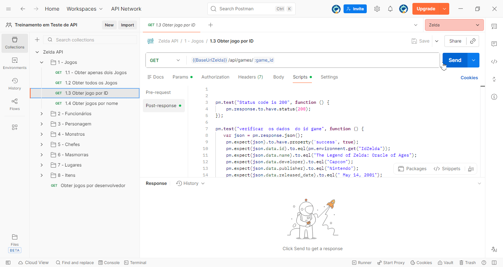

# [Estudo no Zelda API](https://github.com/carloseduardonit/Treinamento-em-Teste-de-API/blob/master/postman/collections/Zelda/Zelda_API.MD)

      

Ir para Readme.md do projeto principal: [Meu treinamento de teste de API](../../Readme.md)

## Descrição
Este coleção Postman foi criada para estudar e testar a [Zelda API](https://zelda.fanapis.com/)
, que fornece dados relacionados ao universo de The Legend of Zelda. A coleção inclui várias requisições para explorar os diferentes endpoints da API, permitindo a obtenção de informações sobre personagens, itens, locais e muito mais.


## Endpoints Incluídos
- Categorias principais:
  - ✅ [1 - Jogos](https://lunar-sunset-96432.postman.co/workspace/Treinamento-em-Teste-de-API~21da8795-e275-4045-84aa-84927b2ed259/folder/25933468-ab5a89ac-ddce-4f29-9687-004e74410d75?action=share&creator=25933468&ctx=documentation)
       - ✅ [1.1 Obter apenas dois jogos](#11-obter-apenas-dois-jogos)
       - ✅ [1.2 Obter todos os jogos](#12-obter-todos-os-jogos)
       - ✅ [1.3 Obter jogo por ID](#13-obter-jogo-por-id)
       - ✅ [1.4 Obter jogos por nome](#14-obter-jogos-por-nome)
  - ⚙️ [2 - Funcionários](https://lunar-sunset-96432.postman.co/workspace/Treinamento-em-Teste-de-API~21da8795-e275-4045-84aa-84927b2ed259/folder/25933468-28aec2f2-336b-4ac3-ad3b-1682bec767b5?action=share&source=copy-link&creator=25933468&active-environment=68141a6c-873f-4116-90ba-17c51a394a4c)
       - ⚙️ [2.1 Obter todos os funcionários](#21-Obter-todos-os-funcionários)
       - ⚙️ [2.2 Obter funcionário por ID](#22-Obter-funcionário-por-ID)
       - ⚙️ [2.3 Obter funcionários por nome](#23-Obter-funcionários-por-nome)
       - testes
  - ⚙️ [3 - Personagens](https://lunar-sunset-96432.postman.co/workspace/Treinamento-em-Teste-de-API~21da8795-e275-4045-84aa-84927b2ed259/folder/25933468-ab5a89ac-ddce-4f29-9687-004e74410d75?action=share&creator=25933468&ctx=documentation)
       - ✅ [3.1 Obter todos os personagens](#31-obter-todos-os-personagens)
       - ✅ [3.2 Obter personagem por ID](#32-obter-personagem-por-id)
       - ✅ [3.3 Obter personagens por nome](#33-obter-personagens-por-nome)
       - testes
  - ⚙️ [4 - Monstros](https://lunar-sunset-96432.postman.co/workspace/Treinamento-em-Teste-de-API~21da8795-e275-4045-84aa-84927b2ed259/folder/25933468-f263c356-f0e0-460a-80f1-f97659de9d11?action=share&creator=25933468&ctx=documentation&active-environment=25933468-68141a6c-873f-4116-90ba-17c51a394a4c)
       - ⚙️ [4.1 Obter todos os monstros](#41-obter-todos-os-monstros)
       - ⚙️ [4.2 Obter monstro por ID](#42-obter-monstro-por-id)
       - ⚙️ [4.3 Obter monstros por nome](#43-obter-monstros-por-nome)
       - testes
  - ⚙️ [5 - Chefes](#https://lunar-sunset-96432.postman.co/workspace/Treinamento-em-Teste-de-API~21da8795-e275-4045-84aa-84927b2ed259/folder/25933468-61e7d48f-3a18-43f5-bed8-c796bc02dabc?action=share&source=copy-link&creator=25933468&ctx=documentation)
       - ⚙️ [5.1 Obter todos os chefes](#51-obter-todos-os-chefes)
       - ⚙️ [5.2 Obter chefe por ID](#52-obter-chefe-por-id)
       - ⚙️ [5.3 Obter chefes por nome](#53-obter-chefes-por-nome)
       - testes
  - ⚙️ [6 - Masmorras](https://lunar-sunset-96432.postman.co/workspace/Treinamento-em-Teste-de-API~21da8795-e275-4045-84aa-84927b2ed259/folder/25933468-77ed6c47-d9f6-4afc-a069-f40e8259e229?action=share&source=copy-link&creator=25933468&ctx=documentation)
       - ⚙️ [6.1 Obter todas as masmorras](#61-obter-todas-as-masmorras)
       - ⚙️ [6.2 Obter masmorra por ID](#62-obter-masmorra-por-id)
       - ⚙️ [6.3 Obter masmorras por nome](#63-obter-masmorras-por-nome)
       - testes
  - ⚙️ [7 - Lugares](https://lunar-sunset-96432.postman.co/workspace/Treinamento-em-Teste-de-API~21da8795-e275-4045-84aa-84927b2ed259/folder/25933468-df3a6bf4-391f-4b67-b39a-967aa2ad9df4?action=share&source=copy-link&creator=25933468&ctx=documentation)
       - ⚙️ [7.1 Obter todos os lugares](#71-obter-todos-os-lugares)
       - ⚙️ [7.2 Obter lugar por ID](#72-obter-lugar-por-id)
       - ⚙️ [7.3 Obter lugares por nome](#73-obter-lugares-por-nome)
       - testes
  - ⚙️ [8 - Itens](https://lunar-sunset-96432.postman.co/workspace/Treinamento-em-Teste-de-API~21da8795-e275-4045-84aa-84927b2ed259/folder/25933468-d31f6922-786d-401b-8ad4-9983c4df060b?action=share&source=copy-link&creator=25933468&ctx=documentation)
       - ⚙️ [8.1 Obter todos os itens](#81-obter-todos-os-itens)
       - ⚙️ [8.2 Obter item por ID](#82-obter-item-por-id)
       - ⚙️ [8.3 Obter itens por nome](#83-obter-itens-por-nome)
       - testes
## Legendas
- ⏳ Aguardando teste
- ⚙️ Teste em andamento
- ✅ Teste concluído

---

[Topo](#estudo-no-zelda-api)

<details>
<summary>

### 0 - Configuração Inicial da Coleção
</summary>

- Definição de Variáveis de Ambiente:
  - `BaseUrlZelda`: Define a URL base para a API da Zelda.
    - Valor: `https://zelda.fanapis.com/`
- Definição de Variáveis do Jogo:
  - `URLJogos`: Define a URL base para o endpoint de jogos.
    - Valor: `{{BaseUrlZelda}}/api/games`
  - `NomeJogo`: Variável para armazenar o nome do jogo a ser pesquisado.
    - Valor: Exemplo: `The Legend of Zelda: Majora's Mask`
  - `IDJogoZelda`: Variável para armazenar o ID do jogo a ser pesquisado.
    - Valor: Exemplo: `5f6ce9d805615a85623ec2b9`
- Definição de Variáveis de Funcionario:
  - `URLFuncionarios`: Define a URL base para o endpoint de funcionários.
    - Valor: `{{BaseUrlZelda}}/api/staff`
  - `NomeFuncionario`: Variável para armazenar o nome do funcionário a ser pesquisado.
    - Valor: Exemplo: ``
  - `IDFuncionarioZelda`: Variável para armazenar o ID do funcionário a ser pesquisado.
    - Valor: Exemplo: ``
- Definição de Variáveis de Personagem:
  - `URLPersonagens`: Define a URL base para o endpoint de personagens.
    - Valor: `{{BaseUrlZelda}}/api/characters`
  - `NomePersonagem`: Variável para armazenar o nome do personagem a ser pesquisado.
    - Valor: Exemplo: `Link`    
  - `IDPersonagemZelda`: Variável para armazenar o ID do personagem a ser pesquisado.
    - Valor: Exemplo: `5f6ce9d805615a85623ec2c3`
- Definição de Variáveis de Monstro:
  - `URLMonstros`: Define a URL base para o endpoint de monstros.
    - Valor: `{{BaseUrlZelda}}/api/monsters`
  - `NomeMonstro`: Variável para armazenar o nome do monstro a ser pesquisado.
    - Valor: Exemplo: ``
  - `IDMonstroZelda`: Variável para armazenar o ID do monstro a ser pesquisado.
    - Valor: Exemplo: ``
- Definição de Variáveis de Chefe:
  - `URLChefes`: Define a URL base para o endpoint de chefes.
    - Valor: `{{BaseUrlZelda}}/api/bosses`
  - `NomeChefe`: Variável para armazenar o nome do chefe a ser pesquisado.
    - Valor: Exemplo: ``
  - `IDChefeZelda`: Variável para armazenar o ID do chefe a ser pesquisado.
    - Valor: Exemplo: ``
- Definição de Variáveis de Masmorra:
  - `URLMasmorras`: Define a URL base para o endpoint de masmorras.
    - Valor: `{{BaseUrlZelda}}/api/dungeons`
    - `NomeMasmorra`: Variável para armazenar o nome da masmorra a ser pesquisada.
      - Valor: Exemplo: ``
    - `IDMasmorraZelda`: Variável para armazenar o ID da masmorra a ser pesquisada.
      - Valor: Exemplo: ``
- Definição de Variáveis de Lugar:
  - `URLLugares`: Define a URL base para o endpoint de lugares.
    - Valor: `{{BaseUrlZelda}}/api/locations`
    - `NomeLugar`: Variável para armazenar o nome do lugar a ser pesquisado.
      - Valor: Exemplo: ``
    - `IDLugarZelda`: Variável para armazenar o ID do lugar a ser pesquisado.
      - Valor: Exemplo: ``
- Definição de Variáveis de Item:
  - `URLItens`: Define a URL base para o endpoint de itens.
    - Valor: `{{BaseUrlZelda}}/api/items`
    - `NomeItem`: Variável para armazenar o nome do item a ser pesquisado.
      - Valor: Exemplo: ``
    - `IDItemZelda`: Variável para armazenar o ID do item a ser pesquisado.
      - Valor: Exemplo: ``
</details>

---

[Topo](#estudo-no-zelda-api)

<details open>
<summary>

### 1 - Jogos
</summary>

- [documentação para jogos](https://docs.zelda.fanapis.com/docs/games)

#### 1.1 Obter apenas dois jogos

#####  Url:

``` url
    GET https://zelda.fanapis.com/api/games?limit=2
```
``` url
    GET {{BaseUrlZelda}}/api/games?limit=2
```

##### Script  de teste de Post-response:
- Implementação do codigo para o teste de API:
``` js


pm.test("Status code is 200", function () {
    pm.response.to.have.status(200);
});

pm.test("A quantidade de Games e igual a dois",function(){
    var quantidadeArray = pm.response.json().data.length;
    var count = pm.response.json().count;
    pm.expect(quantidadeArray).to.eql(count);

});

pm.test("Conferir os dados  do primeiro game", function(){
    var primeiroGame = pm.response.json().data[0];
    pm.expect(primeiroGame.name).to.eql("The Legend of Zelda");
    pm.expect(primeiroGame.developer).to.eql("Nintendo R&D 4");
    pm.expect(primeiroGame.publisher).to.eql("Nintendo");
    pm.expect(primeiroGame.released_date).to.eql(" February 21, 1986");
    pm.expect(primeiroGame.id).to.eql("5f6ce9d805615a85623ec2b7");
});

pm.test("Conferir os dados do segundo game", function () {
    var segundoGame = pm.response.json().data[1];
    pm.expect(segundoGame).to.include(
         {
            "name": "The Legend of Zelda: A Link to the Past",
            "description": "One day, a band of evil thieves managed to open the gateway to the Sacred Realm, where the mystical Triforce was hidden. Upon finding the sacred golden relic, the leader of the thieves, Ganondorf, slew his followers and claimed it as his own. Before long, dark power began to flow forth from the Sacred Realm. People were drawn into this darkness, and never heard from again. As a result, the King of Hyrule ordered the seven sages to seal the entrance to the Sacred Realm. A great battle ensued—monsters poured into the Light World from the sacred land and attacked the castle. The Knights of Hyrule defended the sages during the great battle against evil, and, though most of them perished in the struggle, the sages were able to cast their seal, stopping the flow of darkness and trapping the evil king Ganon within. This battle became known as the Imprisoning War. ",
            "developer": "Nintendo",
            "publisher": "Nintendo",
            
            "id": "5f6ce9d805615a85623ec2b8"
         }
    )
});
```
- Payload de visualização personalizado para exibir os dados dos jogos em uma tabela formatada.
``` html
    // Visualization Script
    var template = `
    <style>
    .games-table-container {
        font-family: Arial, sans-serif;
        padding: 16px;
    }
    .games-table {
        width: 100%;
        border-collapse: collapse;
        margin-top: 10px;
    }
    .games-table th, .games-table td {
        border: 1px solid #ddd;
        padding: 10px;
        text-align: left;
    }
    .games-table th {
        background-color: #4a90d9;
        color: white;
        font-weight: bold;
    }
    .games-table tr:nth-child(even) {
        background-color: #f9f9f9;
    }
    .games-table tr:hover {
        background-color: #f1f1f1;
    }
    .error-message {
        color: #d9534f;
        padding: 20px;
        text-align: center;
        font-size: 16px;
    }
    .description-cell {
        max-width: 200px;
    }
    </style>

    <div class="games-table-container">
    {{#if error}}
        <div class="error-message">{{error}}</div>
    {{else}}
        <h3>Games List ({{count}} results)</h3>
        <table class="games-table">
        <thead>
            <tr>
            <th>ID</th>
            <th>Name</th>
            <th>Console</th>
            <th>Publisher</th>
            <th>Released Year</th>
            <th>Description</th>
            </tr>
        </thead>
        <tbody>
            {{#each games}}
            <tr>
            <td>{{id}}</td>
            <td>{{name}}</td>
            <td>{{developer}}</td>
            <td>{{publisher}}</td>
            <td>{{releasedYear}}</td>
            
            <td class="description-cell">{{description}}</td>
            </tr>
            {{/each}}
        </tbody>
        </table>
    {{/if}}
    </div>
    `;

    function constructVisualizerPayload() {
        var response = pm.response.json();
        
        // Handle error cases
        if (!response || response.success === false) {
            return { error: "Request was not successful. Please check the API response." };
        }
        
        if (!response.data || !Array.isArray(response.data) || response.data.length === 0) {
            return { error: "No game data available in the response." };
        }
        
        // Process games data
        var games = response.data.map(function(game) {
            // Truncate description to 120 chars with ellipsis
            var desc = game.description || "";
            var truncatedDesc = desc.length > 120 ? desc.substring(0, 120) + "..." : desc;
            
            // Extract year from released_date
            var releasedYear = "N/A";
            if (game.released_date) {
                var yearMatch = game.released_date.match(/(\d{4})/);
                if (yearMatch) {
                    releasedYear = yearMatch[1];
                }
            }
            
            return {
                name: game.name || "N/A",
                developer: game.developer || "N/A",
                publisher: game.publisher || "N/A",
                releasedYear: releasedYear,
                id: game.id || "N/A",
                description: truncatedDesc || "N/A"
            };
        });
        
        return {
            games: games,
            count: response.count || games.length
        };
    }

    pm.visualizer.set(template, constructVisualizerPayload());
```

##### Resultado Obtido: 
- Retorna uma lista com dois jogos da série The Legend of Zelda.


#### 1.2 Obter todos os jogos

##### Url:

``` Postman
    GET {{BaseUrlZelda}}/api/games
```
##### Script  de teste de Post-response:

- Implrmentação do codigo para o teste de API:

``` Js   
pm.test("Status code is 200", function () {
    pm.response.to.have.status(200);
});

pm.test("Verificar os dados do jogo", function (){
    var jsonData = pm.response.json();
    var nome = pm.environment.get("NomeJogo");
    pm.expect(jsonData.success).to.be.true;
    pm.expect(jsonData.count).to.equal(1);
    pm.expect(jsonData.data[0].name).to.equal(nome);
    pm.expect(jsonData.data[0].developer).to.equal("Nintendo EAD");
    pm.expect(jsonData.data[0].publisher).to.equal("Nintendo");
    pm.expect(jsonData.data[0].released_date).to.equal(" October 26, 2000");
});
```

- Payload de visualização personalizado para exibir os dados dos jogos em uma tabela formatada.

``` html
var template = `
    <style>
    .games-table-container {
        font-family: Arial, sans-serif;
        padding: 16px;
    }
    .games-table {
        width: 100%;
        border-collapse: collapse;
        margin-top: 10px;
    }
    .games-table th, .games-table td {
        border: 1px solid #ddd;
        padding: 10px;
        text-align: left;
    }
    .games-table th {
        background-color: #4a90d9;
        color: white;
        font-weight: bold;
    }
    .games-table tr:nth-child(even) {
        background-color: #f9f9f9;
    }
    .games-table tr:hover {
        background-color: #f1f1f1;
    }
    .error-message {
        color: #d9534f;
        padding: 20px;
        text-align: center;
        font-size: 16px;
    }
    .description-cell {
        max-width: 200px;
    }
    </style>

    <div class="games-table-container">
    {{#if error}}
        <div class="error-message">{{error}}</div>
    {{else}}
        <h3>Games List ({{count}} results)</h3>
        <table class="games-table">
        <thead>
            <tr>
            <th>ID</th>
            <th>Name</th>
            <th>Console</th>
            <th>Publisher</th>
            <th>Released Year</th>
            <th>Description</th>
            </tr>
        </thead>
        <tbody>
            {{#each games}}
            <tr>
            <td>{{id}}</td>
            <td>{{name}}</td>
            <td>{{developer}}</td>
            <td>{{publisher}}</td>
            <td>{{releasedYear}}</td>
            
            <td class="description-cell">{{description}}</td>
            </tr>
            {{/each}}
        </tbody>
        </table>
    {{/if}}
    </div>
`;

function constructVisualizerPayload() {
    var response = pm.response.json();
    
    // Handle error cases
    if (!response || response.success === false) {
        return { error: "Request was not successful. Please check the API response." };
    }
    
    if (!response.data || !Array.isArray(response.data) || response.data.length === 0) {
        return { error: "No game data available in the response." };
    }
    
    // Process games data
    var games = response.data.map(function(game) {
        // Truncate description to 120 chars with ellipsis
        var desc = game.description || "";
        var truncatedDesc = desc.length > 120 ? desc.substring(0, 120) + "..." : desc;
        
        // Extract year from released_date
        var releasedYear = "N/A";
        if (game.released_date) {
            var yearMatch = game.released_date.match(/(\d{4})/);
            if (yearMatch) {
                releasedYear = yearMatch[1];
            }
        }
        
        return {
            name: game.name || "N/A",
            developer: game.developer || "N/A",
            publisher: game.publisher || "N/A",
            releasedYear: releasedYear,
            id: game.id || "N/A",
            description: truncatedDesc || "N/A"
        };
    });
    
    return {
        games: games,
        count: response.count || games.length
    };
}

pm.visualizer.set(template, constructVisualizerPayload());
```

##### Resultado Obtido: 
- Retorna uma lista com todos os jogos da série The Legend of Zelda.

---

#### 1.3 Obter jogo por ID

##### Url:

``` Postman
    GET {{BaseUrlZelda}}/api/games/:gameId
``` 

##### Script  de teste de Post-response:

- Implementação do codigo para o teste de API:

``` js
pm.test("Status code is 200", function () {
    pm.response.to.have.status(200);
});

pm.test("verificar  os dados  do id game", function () {
   var json = pm.response.json();
    pm.expect(json).to.have.property('success', true);
    pm.expect(json.data.id).to.eql(pm.environment.get("IdZelda"));
    pm.expect(json.data.name).to.eql("The Legend of Zelda: Oracle of Ages");
    pm.expect(json.data.developer).to.eql("Capcom");
    pm.expect(json.data.publisher).to.eql("Nintendo");
    pm.expect(json.data.released_date).to.eql(" May 14, 2001");

});
``` 

- Payload de visualização personalizado para exibir os dados dos jogos em uma tabela formatada.
``` html
/ Visualizer: render response.data as a table (works for object or array)
(function () {
    // Keep existing tests (if any)
    pm.test("Status code is 200", function () {
        pm.response.to.have.status(200);
    });

    // Parse JSON safely
    var json;
    try {
        json = pm.response.json();
    } catch (e) {
        // nothing to visualize
        pm.visualizer.set("<div>No JSON response to visualize</div>", {});
        return;
    }

    // Extract data to visualize - support object or array
    var data = json && json.data !== undefined ? json.data : json;
    if (!data) {
        pm.visualizer.set("<div>No data found in response to visualize</div>", {});
        return;
    }

    // Normalize to array of rows
    var rows = Array.isArray(data) ? data : [data];

    // Compute columns (union of keys across all rows)
    var colsMap = {};
    rows.forEach(function (r) {
        Object.keys(r || {}).forEach(function (k) { colsMap[k] = true; });
    });
    var columns = Object.keys(colsMap);

    // Build Handlebars template for a responsive table
    var template = `
    <style>
      .pm-table { width: 100%; border-collapse: collapse; font-family: Arial, sans-serif;}
      .pm-table th, .pm-table td { border: 1px solid #ddd; padding: 8px; text-align: left; }
      .pm-table th { background: #f4f6f8; font-weight: 600; }
      .pm-no-data { font-family: Arial, sans-serif; color: #666; padding: 12px; }
      .pm-table-wrap { overflow-x: auto; max-width:100%; }
      .pm-id { font-family: monospace; color: #333; }
    </style>
    <div class="pm-table-wrap">
      {{#if rows.length}}
        <table class="pm-table">
          <thead>
            <tr>
              {{#each columns}}
                <th>{{this}}</th>
              {{/each}}
            </tr>
          </thead>
          <tbody>
            {{#each rows}}
              <tr>
                {{#each ../columns}}
                  <td>
                    {{#with (lookup ../this this)}}
                      {{#if this}}
                        {{this}}
                      {{else}}
                        <span style="color:#999">-</span>
                      {{/if}}
                    {{/with}}
                  </td>
                {{/each}}
              </tr>
            {{/each}}
          </tbody>
        </table>
      {{else}}
        <div class="pm-no-data">No rows available to display</div>
      {{/if}}
    </div>
    `;

    // Data for visualizer: rows and columns
    var dataForTemplate = {
        rows: rows,
        columns: columns
    };

    pm.visualizer.set(template, dataForTemplate);
})();
```
##### Resultado Obtido:
- Retorna os detalhes do jogo correspondente ao ID fornecido.

---

#### 1.4 Obter jogos por nome  

##### Url:
``` Postman
    GET {{BaseUrlZelda}}/api/games?name={{NomeJogo}}
```
##### Script  de teste de Post-response:

- Implementação do codigo para o teste de API:
``` js
pm.test("Status code is 200", function () {
    pm.response.to.have.status(200);
});

pm.test("Verificar os dados do jogo", function (){
    var jsonData = pm.response.json();
    var nome = pm.environment.get("NomeJogo");
    pm.expect(jsonData.success).to.be.true;
    pm.expect(jsonData.count).to.equal(1);
    pm.expect(jsonData.data[0].name).to.equal(nome);
    pm.expect(jsonData.data[0].developer).to.equal("Nintendo EAD");
    pm.expect(jsonData.data[0].publisher).to.equal("Nintendo");
    pm.expect(jsonData.data[0].released_date).to.equal(" October 26, 2000");
});
```

- Payload de visualização personalizado para exibir os dados dos jogos em uma tabela formatada.

``` html
var template = `
    <style>
    .games-table-container {
        font-family: Arial, sans-serif;
        padding: 16px;
    }
    .games-table {
        width: 100%;
        border-collapse: collapse;
        margin-top: 10px;
    }
    .games-table th, .games-table td {
        border: 1px solid #ddd;
        padding: 10px;
        text-align: left;
    }
    .games-table th {
        background-color: #4a90d9;
        color: white;
        font-weight: bold;
    }
    .games-table tr:nth-child(even) {
        background-color: #f9f9f9;
    }
    .games-table tr:hover {
        background-color: #f1f1f1;
    }
    .error-message {
        color: #d9534f;
        padding: 20px;
        text-align: center;
        font-size: 16px;
    }
    .description-cell {
        max-width: 200px;
    }
    </style>

    <div class="games-table-container">
    {{#if error}}
        <div class="error-message">{{error}}</div>
    {{else}}
        <h3>Games List ({{count}} results)</h3>
        <table class="games-table">
        <thead>
            <tr>
            <th>ID</th>
            <th>Name</th>
            <th>Console</th>
            <th>Publisher</th>
            <th>Released Year</th>
            <th>Description</th>
            </tr>
        </thead>
        <tbody>
            {{#each games}}
            <tr>
            <td>{{id}}</td>
            <td>{{name}}</td>
            <td>{{developer}}</td>
            <td>{{publisher}}</td>
            <td>{{releasedYear}}</td>
            
            <td class="description-cell">{{description}}</td>
            </tr>
            {{/each}}
        </tbody>
        </table>
    {{/if}}
    </div>
`;

function constructVisualizerPayload() {
    var response = pm.response.json();
    
    // Handle error cases
    if (!response || response.success === false) {
        return { error: "Request was not successful. Please check the API response." };
    }
    
    if (!response.data || !Array.isArray(response.data) || response.data.length === 0) {
        return { error: "No game data available in the response." };
    }
    
    // Process games data
    var games = response.data.map(function(game) {
        // Truncate description to 120 chars with ellipsis
        var desc = game.description || "";
        var truncatedDesc = desc.length > 120 ? desc.substring(0, 120) + "..." : desc;
        
        // Extract year from released_date
        var releasedYear = "N/A";
        if (game.released_date) {
            var yearMatch = game.released_date.match(/(\d{4})/);
            if (yearMatch) {
                releasedYear = yearMatch[1];
            }
        }
        
        return {
            name: game.name || "N/A",
            developer: game.developer || "N/A",
            publisher: game.publisher || "N/A",
            releasedYear: releasedYear,
            id: game.id || "N/A",
            description: truncatedDesc || "N/A"
        };
    });
    
    return {
        games: games,
        count: response.count || games.length
    };
}

pm.visualizer.set(template, constructVisualizerPayload());
```

##### Resultado Obtido: 
- Retorna os jogos que correspondem ao nome fornecido.


</details>

---

[Topo](#estudo-no-zelda-api)

<details>
<summary>

### 2. Funcionários
</summary>

- [Documentação para funcionários](https://docs.zelda.fanapis.com/docs/staff)

#### 2.1 Obter todos os funcionários

##### Url:

``` Postman
    GET {{BaseUrlZelda}}/api/staff
```

##### Script de teste de Post-response
- Implementação do codigo para o teste de API:

``` js
```

- Payload de visualização personalizado para exibir os dados dos funcionários em uma tabela formatada.

``` html
```

#### Resultado Obtido: 
- Retorna uma lista com todos os funcionários envolvidos na criação dos jogos da série The Legend of Zelda.


#### 2.2 Obter funcionário por ID

##### Url:

``` Postman
    GET {{URLFuncionario}}/:staffId
```

##### Script de teste de Post-response
- Implementação do codigo para o teste de API:

``` js
```

- Payload de visualização personalizado para exibir os dados dos funcionários em uma tabela formatada.

``` html
```

#### Resultado Obtido: 
- Retorna os detalhes do funcionário correspondente ao ID fornecido.


---

#### 2.3 Obter funcionários por nome

##### Url:

``` Postman
    GET {{URLFuncionario}}?name={{NomeFuncionario}}
```

##### Script de teste de Post-response
- Implementação do codigo para o teste de API:

``` js
```

- Payload de visualização personalizado para exibir os dados dos funcionários em uma tabela formatada.

``` html
```

#### Resultado Obtido: 
- Retorna os funcionários que correspondem ao nome fornecido.


</details>

---
[Topo](#estudo-no-zelda-api)

<details>
<summary>

### 3. Personagens

</summary>

- [Documentação para personagens](https://docs.zelda.fanapis.com/docs/characters)

#### 3.1 Obter todos os personagens

##### Url:

``` Postman
    GET {{BaseUrlZelda}}/api/characters
```
##### Script  de teste de Post-response:

```
    // Visualization Script

    var template = `
    <style>
        .viz-container {
            font-family: Arial, sans-serif;
            padding: 20px;
        }
        .char-table {
            width: 100%;
            border-collapse: collapse;
            margin-bottom: 30px;
        }
        .char-table th, .char-table td {
            border: 1px solid #ddd;
            padding: 8px;
            text-align: left;
        }
        .char-table th {
            background-color: #4CAF50;
            color: white;
        }
        .char-table tr:nth-child(even) {
            background-color: #f2f2f2;
        }
        .char-table tr:hover {
            background-color: #ddd;
        }
        .charts-container {
            display: flex;
            justify-content: space-around;
            align-items: flex-start;
            gap: 20px;
        }
        .chart-wrapper {
            flex: 1;
            max-width: 45%;
        }
    </style>

    <div class="viz-container">
        <h3>Character Data</h3>
        <table class="char-table">
            <thead>
                <tr>
                    <th>ID</th>
                    <th>Name</th>
                    <th>Gender</th>
                    <th>Race</th>
                    <th>First Appearance</th>
                    
                </tr>
            </thead>
            <tbody>
                {{#each characters}}
                <tr>
                    <td>{{id}}</td>
                    <td>{{name}}</td>
                    <td>{{gender}}</td>
                    <td>{{race}}</td>
                    <td>{{firstAppearance}}</td>
                    
                </tr>
                {{/each}}
            </tbody>
        </table>

        <div class="charts-container">
            <div class="chart-wrapper">
                <canvas id="genderChart"></canvas>
            </div>
            <div class="chart-wrapper">
                <canvas id="raceChart"></canvas>
            </div>
        </div>
    </div>

    <script src="https://cdnjs.cloudflare.com/ajax/libs/Chart.js/2.5.0/Chart.min.js"></script>
    <script>
        pm.getData(function (err, value) {
            // Chart A: Gender Distribution (Bar Chart)
            var genderCtx = document.getElementById("genderChart");
            new Chart(genderCtx, {
                type: "bar",
                data: {
                    labels: value.genderLabels,
                    datasets: [{
                        label: "Characters by Gender",
                        data: value.genderCounts,
                        backgroundColor: ["#36A2EB", "#FF6384", "#FFCE56"],
                        borderColor: ["#36A2EB", "#FF6384", "#FFCE56"],
                        borderWidth: 1
                    }]
                },
                options: {
                    legend: { display: false },
                    title: {
                        display: true,
                        text: "Character Distribution by Gender"
                    },
                    scales: {
                        yAxes: [{
                            ticks: { beginAtZero: true },
                            scaleLabel: {
                                display: true,
                                labelString: "Count"
                            }
                        }],
                        xAxes: [{
                            scaleLabel: {
                                display: true,
                                labelString: "Gender"
                            }
                        }]
                    }
                }
            });

            // Chart B: Top 10 Races (Horizontal Bar Chart)
            var raceCtx = document.getElementById("raceChart");
            new Chart(raceCtx, {
                type: "horizontalBar",
                data: {
                    labels: value.raceLabels,
                    datasets: [{
                        label: "Characters by Race",
                        data: value.raceCounts,
                        backgroundColor: "#4BC0C0",
                        borderColor: "#4BC0C0",
                        borderWidth: 1
                    }]
                },
                options: {
                    legend: { display: false },
                    title: {
                        display: true,
                        text: "Top 10 Races"
                    },
                    scales: {
                        xAxes: [{
                            ticks: { beginAtZero: true },
                            scaleLabel: {
                                display: true,
                                labelString: "Count"
                            }
                        }],
                        yAxes: [{
                            scaleLabel: {
                                display: true,
                                labelString: "Race"
                            }
                        }]
                    }
                }
            });
        });
    </script>
    `;

    function constructVisualizerPayload() {
        var response = pm.response.json();
        var data = response.data || [];

        // Prepare table data
        var characters = data.map(function(char) {
            return {
                name: char.name || "",
                gender: char.gender || "",
                race: char.race || "",
                firstAppearance: (char.appearances && char.appearances.length > 0) ? char.appearances[0] : "",
                id: char.id || ""
            };
        });

        // Prepare gender chart data
        var genderMap = {};
        data.forEach(function(char) {
            var gender = char.gender || "Unknown";
            genderMap[gender] = (genderMap[gender] || 0) + 1;
        });
        var genderLabels = Object.keys(genderMap);
        var genderCounts = genderLabels.map(function(label) {
            return genderMap[label];
        });

        // Prepare race chart data (top 10)
        var raceMap = {};
        data.forEach(function(char) {
            var race = char.race || "Unknown";
            raceMap[race] = (raceMap[race] || 0) + 1;
        });
        var raceEntries = Object.keys(raceMap).map(function(key) {
            return { label: key, count: raceMap[key] };
        });
        raceEntries.sort(function(a, b) {
            return b.count - a.count;
        });
        var top10Races = raceEntries.slice(0, 10);
        var raceLabels = top10Races.map(function(entry) {
            return entry.label;
        });
        var raceCounts = top10Races.map(function(entry) {
            return entry.count;
        });

        return {
            characters: characters,
            genderLabels: genderLabels,
            genderCounts: genderCounts,
            raceLabels: raceLabels,
            raceCounts: raceCounts
        };
    }

    pm.visualizer.set(template, constructVisualizerPayload());
```
##### Resultado Obtido: 

- Retorna uma lista com todos os personagens da série The Legend of Zelda.

---

#### 3.2 Obter personagem por ID

##### Url:

```text
    GET {{BaseUrlZelda}}/api/characters/:characterId
```
##### Script  de teste de Post-response:
``` Js
    // Parse the JSON response
    const response = pm.response.json();

    // Build the visualization template
    var template = `
    <style>
        body { font-family: Arial, sans-serif; margin: 20px; }
        table { border-collapse: collapse; width: 100%; margin-top: 10px; }
        th, td { border: 1px solid #ddd; padding: 10px; text-align: left; vertical-align: top; }
        th { background-color: #4a90d9; color: white; font-weight: bold; }
        tr:nth-child(even) { background-color: #f9f9f9; }
        tr:hover { background-color: #f1f1f1; }
        .cell-content { max-width: 400px; word-wrap: break-word; }
    </style>

    <h3>Response Data</h3>
    <table>
        <thead>
            <tr>
                {{#each headers}}
                <th>{{this}}</th>
                {{/each}}
            </tr>
        </thead>
        <tbody>
            {{#each rows}}
            <tr>
                {{#each this}}
                <td><div class="cell-content">{{this}}</div></td>
                {{/each}}
            </tr>
            {{/each}}
        </tbody>
    </table>
    `;

    // Function to construct the visualizer payload
    function constructVisualizerPayload() {
        let dataArray = [];
        
        // Handle different response structures
        if (response.data) {
            // If data is an array, use it directly
            if (Array.isArray(response.data)) {
                dataArray = response.data;
            } else {
                // If data is a single object, wrap it in an array
                dataArray = [response.data];
            }
        } else if (response.results) {
            // Handle response.results structure
            if (Array.isArray(response.results)) {
                dataArray = response.results;
            } else {
                dataArray = [response.results];
            }
        } else if (Array.isArray(response)) {
            // If response itself is an array
            dataArray = response;
        } else {
            // If response is a single object without data/results wrapper
            dataArray = [response];
        }
        
        // Get headers from the first item's keys
        let headers = [];
        if (dataArray.length > 0) {
            headers = Object.keys(dataArray[0]);
        }
        
        // Build rows with safely stringified values
        let rows = dataArray.map(function(item) {
            return headers.map(function(key) {
                let value = item[key];
                // Safely stringify nested objects/arrays
                if (value === null || value === undefined) {
                    return '';
                } else if (typeof value === 'object') {
                    return JSON.stringify(value);
                } else {
                    return String(value);
                }
            });
        });
        
        return { headers: headers, rows: rows };
    }

    // Set the visualizer
    pm.visualizer.set(template, constructVisualizerPayload());
```
##### Resultado Obtido: 
- Retorna os detalhes do personagem correspondente ao ID fornecido.

---
#### 3.3 Obter personagens por nome
> [!NOTE]
> estou utilizando o mesmo recurso de Post-Response do item: [2.1 Obter todos os personagens](#21-obter-todos-os-personagens) para melhor visualização dos dados retornados.
##### Url:
``` Postman
    GET {{BaseUrlZelda}}/api/characters?name={{NomePersonagem}}
```
```
    GET {{URLPersonagens}}?name={{nomePersonagem}}
```

##### Script de teste de Post-response
- Implementação do codigo para o teste de API:

``` js
```

- Payload de visualização personalizado para exibir os dados dos funcionários em uma tabela formatada.

``` html
```

##### Resultado Obtido: 
- Retorna os personagens que correspondem ao nome fornecido.

---
</details>

---
[Topo](#estudo-no-zelda-api)

<details>
<summary>

### 4. Monstros

</summary>

- [Documentação para monstros](https://docs.zelda.fanapis.com/docs/monsters)

#### 4.1 Obter todos os monstros

##### Url:

``` Postman
    GET {{BaseUrlZelda}}/api/monsters
```

##### Script de teste de Post-response
- Implementação do codigo para o teste de API:

``` js
```

- Payload de visualização personalizado para exibir os dados dos funcionários em uma tabela formatada.

``` html
```

##### Resultado Obtido: 
- Retorna uma lista com todos os monstros da série The Legend of Zelda.

---
#### 4.2 Obter monstro por ID

##### Url:

``` Postman
    GET {{BaseUrlZelda}}/api/monsters/:monsterId
```

##### Script de teste de Post-response
- Implementação do codigo para o teste de API:

``` js
```

- Payload de visualização personalizado para exibir os dados dos funcionários em uma tabela formatada.

``` html
```

#### Resultado Obtido: 
- Retorna os detalhes do monstro correspondente ao ID fornecido.

---
#### 4.3 Obter monstros por nome

##### Url:

``` Postman
    GET {{BaseUrlZelda}}/api/monsters?name={{NomeMonstro}}
```

##### Script de teste de Post-response
- Implementação do codigo para o teste de API:

``` js
```

- Payload de visualização personalizado para exibir os dados dos funcionários em uma tabela formatada.

``` html
```

#### Resultado Obtido: 
- Retorna os monstros que correspondem ao nome fornecido.

---

</details>

[Topo](#estudo-no-zelda-api)

<details>
<summary>

### 5. Chefes

</summary>

- [Documentação para chefes](https://docs.zelda.fanapis.com/docs/bosses)

#### 5.1 Obter todos os chefes

##### Url:

``` Postman
    GET {{BaseUrlZelda}}/api/bosses
```

##### Script de teste de Post-response
- Implementação do codigo para o teste de API:

``` js
```

- Payload de visualização personalizado para exibir os dados dos funcionários em uma tabela formatada.

``` html
```

#### 5.2 Obter chefe por ID

##### Url:

``` Postman
    GET {{BaseUrlZelda}}/api/bosses/:bossId
```

##### Script de teste de Post-response
- Implementação do codigo para o teste de API:

``` js
```

- Payload de visualização personalizado para exibir os dados dos funcionários em uma tabela formatada.

``` html
```

#### 5.3 Obter chefes por nome

##### Url:

``` Postman
    GET {{BaseUrlZelda}}/api/bosses?name={{NomeChefe}}
```

##### Script de teste de Post-response
- Implementação do codigo para o teste de API:

``` js
```

- Payload de visualização personalizado para exibir os dados dos funcionários em uma tabela formatada.

``` html
```


</details>

---

[Topo](#estudo-no-zelda-api)

<details>

<summary>

### 6. Masmorras

</summary>

- [Documentação para masmorras](https://docs.zelda.fanapis.com/docs/dungeons)

#### 6.1 Obter todas as masmorras

##### Url:

``` Postman
    GET {{BaseUrlZelda}}/api/dungeons
```

##### Script de teste de Post-response
- Implementação do codigo para o teste de API:

``` js
```

- Payload de visualização personalizado para exibir os dados dos funcionários em uma tabela formatada.

``` html
```


#### 6.2 Obter masmorra por ID

##### Url:

``` Postman
    GET {{BaseUrlZelda}}/api/dungeons/:dungeonId
```

##### Script de teste de Post-response
- Implementação do codigo para o teste de API:

``` js
```

- Payload de visualização personalizado para exibir os dados dos funcionários em uma tabela formatada.

``` html
```

#### 6.3 Obter masmorras por nome

##### Url:

``` Postman
    GET {{BaseUrlZelda}}/api/dungeons?name={{NomeMasmorra}}
```

##### Script de teste de Post-response
- Implementação do codigo para o teste de API:

``` js
```

- Payload de visualização personalizado para exibir os dados dos funcionários em uma tabela formatada.

``` html
```

</details>

---
[Topo](#estudo-no-zelda-api)

<details>
<summary>


### 7. Lugares

- [Documentação para lugares](https://docs.zelda.fanapis.com/docs/locations)

#### 7.1 Obter todos os lugares

##### Url:

``` Postman
    GET {{BaseUrlZelda}}/api/locations
```

##### Script de teste de Post-response
- Implementação do codigo para o teste de API:

``` js
```

- Payload de visualização personalizado para exibir os dados dos funcionários em uma tabela formatada.

``` html
```


#### 7.2 Obter lugar por ID

##### Url:

``` Postman
    GET {{BaseUrlZelda}}/api/locations/:locationId
```

##### Script de teste de Post-response
- Implementação do codigo para o teste de API:

``` js
```

- Payload de visualização personalizado para exibir os dados dos funcionários em uma tabela formatada.

``` html
```


#### 7.3 Obter lugares por nome

##### Url:

``` Postman
    GET {{BaseUrlZelda}}/api/locations?name={{NomeLugar}}
```

##### Script de teste de Post-response
- Implementação do codigo para o teste de API:

``` js
```

- Payload de visualização personalizado para exibir os dados dos funcionários em uma tabela formatada.

``` html
```
</details>

---
[Topo](#estudo-no-zelda-api)

<details>
<summary>

### 8. Itens
</summary>

- [Documentação para itens](https://docs.zelda.fanapis.com/docs/items)

#### 8.1 Obter todos os itens
##### Url:

``` Postman
    GET {{BaseUrlZelda}}/api/items
```

##### Script de teste de Post-response
- Implementação do codigo para o teste de API:

``` js
```

- Payload de visualização personalizado para exibir os dados dos funcionários em uma tabela formatada.

``` html
```

#### 8.2 Obter item por ID

##### Url:

``` Postman
    GET {{URLItens}}/:itemId
```

##### Script de teste de Post-response
- Implementação do codigo para o teste de API:

``` js
```

- Payload de visualização personalizado para exibir os dados dos funcionários em uma tabela formatada.

``` html
```

#### 8.3 Obter itens por nome

##### Url:

``` Postman
    GET {{URLItens}}/?name={{NomeItem}}
```
##### Script  de teste de Post-response:

- Teste
```
    var ID = pm.response.json().data[0].id;
    var Nome = pm.response.json().data[0].name; // Nome do item
    const gameIds = pm.response.json().data[0].games; // Array de IDs de jogos
    var URLGame = gameIds[0];

    pm.test(" 1 - O Status e  igual a 200",function(){
        pm.expect(pm.response.code).to.eql(200);
    });

    pm.test("2 - O nome do item é igual a Ancient Battle Axe", function(){
    var Lnome = pm.environment.get("NomeItem");
        pm.expect(Nome).to.eql(Lnome);
    });

    pm.test("3 - O ID do item é igual a 5f6e9a9dfee1a5347127c76e", function () {
        var Lid = "5f6e9a9dfee1a5347127c76e";
        pm.expect(ID).to.eql(Lid);
    });

    pm.sendRequest(URLGame,function(err, res){
        let count = gameIds.length;
        if(count > 0){
        pm.test("4.0 - O jogo foi encontrado ", function(){
            pm.expect(count).to.be.above(0);
        });
        pm.test("4.1 - O nome do jogo é igual a The Legend of Zelda: Breath of the Wild", function () {
                var LnomeJogo = "The Legend of Zelda: Breath of the Wild";
                pm.expect(res.json().data.name).to.eql(LnomeJogo);
            });
            pm.test("4.2 - O nome do desenvolvedor do jogo é igual a Nintendo", function () {
                var LnomeDesenvolvedor = "Nintendo";
                pm.expect(res.json().data.developer).to.eql(LnomeDesenvolvedor);
            });
            pm.test("4.3 - O nome do Publicado do jogo é igual a Nintendo",function(){
                var Lpublisher = "Nintendo";
                pm.expect(res.json().data.publisher).to.eql(Lpublisher);
            });
            pm.test("4.4 - A data de Lançamento do jogo é igual a March 3, 2017", function () {
                var Lreleased_date = " March 3, 2017";
                pm.expect(res.json().data.released_date).to.eql(Lreleased_date)
            });

        } else {
            pm.test("4.0 - O jogo não foi encontrado", function () {
                pm.expect(count).to.eql(0);
            });
        }
    });

```

##### Resultado Obtido:
- 

</details>

---
[Topo](#estudo-no-zelda-api)

## Bibliografia:
- [Documentação Oficial da Zelda API](https://docs.zelda.fanapis.com/docs)
- [Postman Learning Center](https://learning.postman.com/docs/getting-started/introduction)
