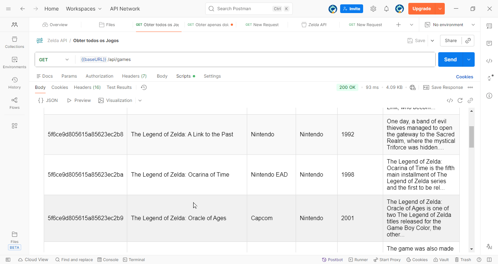

# Estudo no Zelda API

   

Ir para Readme.md do projeto principal: [Meu treinamento de teste de API](../../Readme.md)

## Descrição
Este coleção Postman foi criada para estudar e testar a [Zelda API](https://zelda.fanapis.com/)
, que fornece dados relacionados ao universo de The Legend of Zelda. A coleção inclui várias requisições para explorar os diferentes endpoints da API, permitindo a obtenção de informações sobre personagens, itens, locais e muito mais.


## Endpoints Incluídos
- Categorias principais:
    - [Jogos](https://lunar-sunset-96432.postman.co/workspace/Treinamento-em-Teste-de-API~21da8795-e275-4045-84aa-84927b2ed259/folder/25933468-ab5a89ac-ddce-4f29-9687-004e74410d75?action=share&creator=25933468&ctx=documentation)
        - [Obter apenas dois jogos](#obter-apenas-dois-jogos)
        - [Obter todos os jogos](#obter-todos-os-jogos)
        - Obter jogo por ID  
        - Obter jogos por nome  
        - Obter jogos por desenvolvedor
    - Personagens

    - Itens
    - Localizações
    - Jogos
    - Habilidades
    - Efeitos


### Jogos

- [documentação para jogos](https://docs.zelda.fanapis.com/docs/games)

#### Configuração

##### Base Url:
``` 
  https://zelda.fanapis.com/
```
#### Obter apenas dois jogos
#####  Url:
``` 
 GET https://zelda.fanapis.com/api/games?limit=2
```
##### Url:
``` 
 GET {{BaseUrl}}/api/games?limit=2
```

##### Script  de teste de Post-response:
```
var template = `
<style>
  .games-table-container {
    font-family: Arial, sans-serif;
    padding: 16px;
  }
  .games-table {
    width: 100%;
    border-collapse: collapse;
    margin-top: 10px;
  }
  .games-table th, .games-table td {
    border: 1px solid #ddd;
    padding: 10px;
    text-align: left;
  }
  .games-table th {
    background-color: #4a90d9;
    color: white;
    font-weight: bold;
  }
  .games-table tr:nth-child(even) {
    background-color: #f9f9f9;
  }
  .games-table tr:hover {
    background-color: #f1f1f1;
  }
  .error-message {
    color: #d9534f;
    padding: 20px;
    text-align: center;
    font-size: 16px;
  }
  .description-cell {
    max-width: 200px;
  }
</style>

<div class="games-table-container">
  {{#if error}}
    <div class="error-message">{{error}}</div>
  {{else}}
    <h3>Games List ({{count}} results)</h3>
    <table class="games-table">
      <thead>
        <tr>
          <th>ID</th>
          <th>Name</th>
          <th>Console</th>
          <th>Publisher</th>
          <th>Released Year</th>
          <th>Description</th>
        </tr>
      </thead>
      <tbody>
        {{#each games}}
        <tr>
        <td>{{id}}</td>
          <td>{{name}}</td>
          <td>{{developer}}</td>
          <td>{{publisher}}</td>
          <td>{{releasedYear}}</td>
          
          <td class="description-cell">{{description}}</td>
        </tr>
        {{/each}}
      </tbody>
    </table>
  {{/if}}
</div>
`;

function constructVisualizerPayload() {
    var response = pm.response.json();
    
    // Handle error cases
    if (!response || response.success === false) {
        return { error: "Request was not successful. Please check the API response." };
    }
    
    if (!response.data || !Array.isArray(response.data) || response.data.length === 0) {
        return { error: "No game data available in the response." };
    }
    
    // Process games data
    var games = response.data.map(function(game) {
        // Truncate description to 120 chars with ellipsis
        var desc = game.description || "";
        var truncatedDesc = desc.length > 120 ? desc.substring(0, 120) + "..." : desc;
        
        // Extract year from released_date
        var releasedYear = "N/A";
        if (game.released_date) {
            var yearMatch = game.released_date.match(/(\d{4})/);
            if (yearMatch) {
                releasedYear = yearMatch[1];
            }
        }
        
        return {
            name: game.name || "N/A",
            developer: game.developer || "N/A",
            publisher: game.publisher || "N/A",
            releasedYear: releasedYear,
            id: game.id || "N/A",
            description: truncatedDesc || "N/A"
        };
    });
    
    return {
        games: games,
        count: response.count || games.length
    };
}

pm.visualizer.set(template, constructVisualizerPayload());
```
##### Resultado Obtido: 
- Retorna uma lista com dois jogos da série The Legend of Zelda.


#### Obter todos os jogos

##### Url:
``` 
 GET {{BaseUrl}}/api/games
```
##### Resultado Obtido: 
- Retorna uma lista com todos os jogos da série The Legend of Zelda.



### Personagens


## Como Usar Esta Coleção

## Bibliografia:
- [Documentação Oficial da Zelda API](https://docs.zelda.fanapis.com/docs)
- [Postman Learning Center](https://learning.postman.com/docs/getting-started/introduction)
