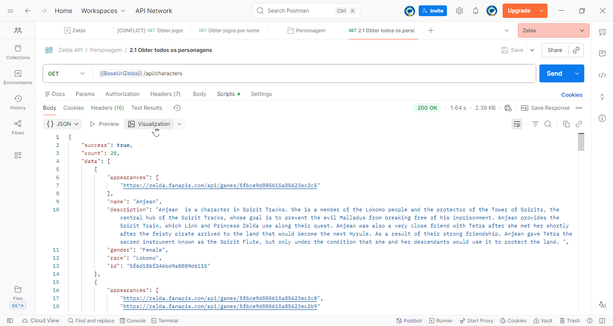
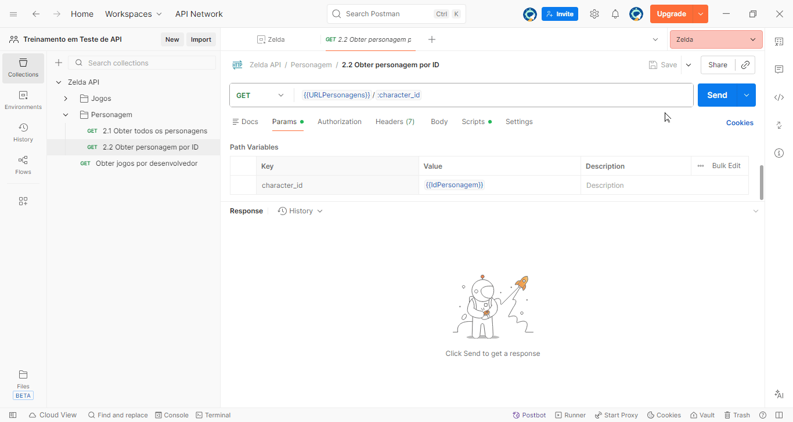

# [Estudo no Zelda API](https://github.com/carloseduardonit/Treinamento-em-Teste-de-API/blob/master/postman/collections/Zelda/Zelda_API.MD)

      

Ir para Readme.md do projeto principal: [Meu treinamento de teste de API](../../Readme.md)

## Descrição
Este coleção Postman foi criada para estudar e testar a [Zelda API](https://zelda.fanapis.com/)
, que fornece dados relacionados ao universo de The Legend of Zelda. A coleção inclui várias requisições para explorar os diferentes endpoints da API, permitindo a obtenção de informações sobre personagens, itens, locais e muito mais.


## Endpoints Incluídos
- Categorias principais:
  - ⚙️ [1 - Jogos](https://lunar-sunset-96432.postman.co/workspace/Treinamento-em-Teste-de-API~21da8795-e275-4045-84aa-84927b2ed259/folder/25933468-ab5a89ac-ddce-4f29-9687-004e74410d75?action=share&creator=25933468&ctx=documentation)
       - ✅ [1.1 Obter apenas dois jogos](#11-obter-apenas-dois-jogos)
       - ✅ [1.2 Obter todos os jogos](#12-obter-todos-os-jogos)
       - ⚙️ [1.3 Obter jogo por ID](#13-obter-jogo-por-id)
       - ✅ [1.4 Obter jogos por nome](#14-obter-jogos-por-nome)
       - ⚙️ [1.5 Obter jogos por desenvolvedor](#15-obter-jogos-por-desenvolvedor)
  - ⚙️ [2 - Funcionários](https://lunar-sunset-96432.postman.co/workspace/Treinamento-em-Teste-de-API~21da8795-e275-4045-84aa-84927b2ed259/folder/25933468-28aec2f2-336b-4ac3-ad3b-1682bec767b5?action=share&source=copy-link&creator=25933468&active-environment=68141a6c-873f-4116-90ba-17c51a394a4c)
        - ⚙️ [2.1 Obter todos os funcionários](#21-Obter-todos-os-funcionários)
        - ⚙️ [2.2 Obter funcionário por ID](#22-Obter-funcionário-por-ID)
        - ⚙️ [2.3 Obter funcionários por nome](#23-Obter-funcionários-por-nome)
        - testes
  - ⚙️ [3 - Personagens](https://lunar-sunset-96432.postman.co/workspace/Treinamento-em-Teste-de-API~21da8795-e275-4045-84aa-84927b2ed259/folder/25933468-ab5a89ac-ddce-4f29-9687-004e74410d75?action=share&creator=25933468&ctx=documentation)
       - ✅ [3.1 Obter todos os personagens](#31-obter-todos-os-personagens)
       - ✅ [3.2 Obter personagem por ID](#32-obter-personagem-por-id)
       - ✅ [3.3 Obter personagens por nome](#33-obter-personagens-por-nome)
       - testes
  - ⚙️ [4 - Monstros](https://lunar-sunset-96432.postman.co/workspace/Treinamento-em-Teste-de-API~21da8795-e275-4045-84aa-84927b2ed259/folder/25933468-f263c356-f0e0-460a-80f1-f97659de9d11?action=share&creator=25933468&ctx=documentation&active-environment=25933468-68141a6c-873f-4116-90ba-17c51a394a4c)
       - ⚙️ [4.1 Obter todos os monstros](#41-obter-todos-os-monstros)
       - ⚙️ [4.2 Obter monstro por ID](#42-obter-monstro-por-id)
       - ⚙️ [4.3 Obter monstros por nome](#43-obter-monstros-por-nome)
       - testes
  - ⏳ [5 - Chefes](#url-8)
       - ⏳ [5.1 Obter todos os chefes](#51-obter-todos-os-chefes)
       - ⏳ [5.2 Obter chefe por ID](#52-obter-chefe-por-id)
       - ⏳ [5.3 Obter chefes por nome](#53-obter-chefes-por-nome)
       - testes
  - ⏳ [6 - Masmorras](#url-9)
       - ⏳ [6.1 Obter todas as masmorras](#61-obter-todas-as-masmorras)
       - ⏳ [6.2 Obter masmorra por ID](#62-obter-masmorra-por-id)
       - ⏳ [6.3 Obter masmorras por nome](#63-obter-masmorras-por-nome)
       - testes
  - ⏳ [7 - Lugares]()
       - ⏳ [7.1 Obter todos os lugares](#71-obter-todos-os-lugares)
       - ⏳ [7.2 Obter lugar por ID](#72-obter-lugar-por-id)
       - ⏳ [7.3 Obter lugares por nome](#73-obter-lugares-por-nome)
       - testes
  - ⏳ [8 - Itens]()
       - ⏳ [8.1 Obter todos os itens](#81-obter-todos-os-itens)
       - ⏳ [8.2 Obter item por ID](#82-obter-item-por-id)
       - ⏳ [8.3 Obter itens por nome](#83-obter-itens-por-nome)
       - testes
## Legendas
- ⏳ Aguardando teste
- ⚙️ Teste em andamento
- ✅ Teste concluído

---

[Topo](#estudo-no-zelda-api)

### 0 - Configuração Inicial da Coleção
- Definição de Variáveis de Ambiente:
  - `BaseUrlZelda`: Define a URL base para a API da Zelda.
    - Valor: `https://zelda.fanapis.com/`
- Definição de Variáveis do Jogo:
  - `URLJogos`: Define a URL base para o endpoint de jogos.
    - Valor: `{{BaseUrlZelda}}/api/games`
  - `NomeJogo`: Variável para armazenar o nome do jogo a ser pesquisado.
    - Valor: Exemplo: `The Legend of Zelda: Majora's Mask`
  - `IDJogoZelda`: Variável para armazenar o ID do jogo a ser pesquisado.
    - Valor: Exemplo: `5f6ce9d805615a85623ec2b9`
  - `NomeDesenvolvedor`: Variável para armazenar o nome do desenvolvedor a ser pesquisado.
    - Valor: Exemplo: `Nintendo`
- Definição de Variáveis de Funcionario:
  - `URLFuncionarios`: Define a URL base para o endpoint de funcionários.
    - Valor: `{{BaseUrlZelda}}/api/staff`
  - `NomeFuncionario`: Variável para armazenar o nome do funcionário a ser pesquisado.
    - Valor: Exemplo: ``
  - `IDFuncionarioZelda`: Variável para armazenar o ID do funcionário a ser pesquisado.
    - Valor: Exemplo: ``
- Definição de Variáveis de Personagem:
  - `URLPersonagens`: Define a URL base para o endpoint de personagens.
    - Valor: `{{BaseUrlZelda}}/api/characters`
  - `NomePersonagem`: Variável para armazenar o nome do personagem a ser pesquisado.
    - Valor: Exemplo: `Link`    
  - `IDPersonagemZelda`: Variável para armazenar o ID do personagem a ser pesquisado.
    - Valor: Exemplo: `5f6ce9d805615a85623ec2c3`
- Definição de Variáveis de Monstro:
  - `URLMonstros`: Define a URL base para o endpoint de monstros.
    - Valor: `{{BaseUrlZelda}}/api/monsters`
  - `NomeMonstro`: Variável para armazenar o nome do monstro a ser pesquisado.
    - Valor: Exemplo: ``
  - `IDMonstroZelda`: Variável para armazenar o ID do monstro a ser pesquisado.
    - Valor: Exemplo: ``
- Definição de Variáveis de Chefe:
  - `URLChefes`: Define a URL base para o endpoint de chefes.
    - Valor: `{{BaseUrlZelda}}/api/bosses`
  - `NomeChefe`: Variável para armazenar o nome do chefe a ser pesquisado.
    - Valor: Exemplo: ``
  - `IDChefeZelda`: Variável para armazenar o ID do chefe a ser pesquisado.
    - Valor: Exemplo: ``
- Definição de Variáveis de Masmorra:
  - `URLMasmorras`: Define a URL base para o endpoint de masmorras.
    - Valor: `{{BaseUrlZelda}}/api/dungeons`
    - `NomeMasmorra`: Variável para armazenar o nome da masmorra a ser pesquisada.
      - Valor: Exemplo: ``
    - `IDMasmorraZelda`: Variável para armazenar o ID da masmorra a ser pesquisada.
      - Valor: Exemplo: ``
- Definição de Variáveis de Lugar:
  - `URLLugares`: Define a URL base para o endpoint de lugares.
    - Valor: `{{BaseUrlZelda}}/api/locations`
    - `NomeLugar`: Variável para armazenar o nome do lugar a ser pesquisado.
      - Valor: Exemplo: ``
    - `IDLugarZelda`: Variável para armazenar o ID do lugar a ser pesquisado.
      - Valor: Exemplo: ``
- Definição de Variáveis de Item:
  - `URLItens`: Define a URL base para o endpoint de itens.
    - Valor: `{{BaseUrlZelda}}/api/items`
    - `NomeItem`: Variável para armazenar o nome do item a ser pesquisado.
      - Valor: Exemplo: ``
    - `IDItemZelda`: Variável para armazenar o ID do item a ser pesquisado.
      - Valor: Exemplo: ``

---
[Topo](#estudo-no-zelda-api)


<details>
<summary>

### 1 - Jogos
</summary>
- [documentação para jogos](https://docs.zelda.fanapis.com/docs/games)

#### 1.0 - Configuração

##### Base Url do Zelda :

``` url
    https://zelda.fanapis.com/
```
#### 1.1 Obter apenas dois jogos

#####  Url:

``` url
    GET https://zelda.fanapis.com/api/games?limit=2
```
``` url
    GET {{BaseUrlZelda}}/api/games?limit=2
```

##### Script  de teste de Post-response:

```
    var template = `
    <style>
    .games-table-container {
        font-family: Arial, sans-serif;
        padding: 16px;
    }
    .games-table {
        width: 100%;
        border-collapse: collapse;
        margin-top: 10px;
    }
    .games-table th, .games-table td {
        border: 1px solid #ddd;
        padding: 10px;
        text-align: left;
    }
    .games-table th {
        background-color: #4a90d9;
        color: white;
        font-weight: bold;
    }
    .games-table tr:nth-child(even) {
        background-color: #f9f9f9;
    }
    .games-table tr:hover {
        background-color: #f1f1f1;
    }
    .error-message {
        color: #d9534f;
        padding: 20px;
        text-align: center;
        font-size: 16px;
    }
    .description-cell {
        max-width: 200px;
    }
    </style>

    <div class="games-table-container">
    {{#if error}}
        <div class="error-message">{{error}}</div>
    {{else}}
        <h3>Games List ({{count}} results)</h3>
        <table class="games-table">
        <thead>
            <tr>
            <th>ID</th>
            <th>Name</th>
            <th>Console</th>
            <th>Publisher</th>
            <th>Released Year</th>
            <th>Description</th>
            </tr>
        </thead>
        <tbody>
            {{#each games}}
            <tr>
            <td>{{id}}</td>
            <td>{{name}}</td>
            <td>{{developer}}</td>
            <td>{{publisher}}</td>
            <td>{{releasedYear}}</td>
            
            <td class="description-cell">{{description}}</td>
            </tr>
            {{/each}}
        </tbody>
        </table>
    {{/if}}
    </div>
    `;

    function constructVisualizerPayload() {
        var response = pm.response.json();
        
        // Handle error cases
        if (!response || response.success === false) {
            return { error: "Request was not successful. Please check the API response." };
        }
        
        if (!response.data || !Array.isArray(response.data) || response.data.length === 0) {
            return { error: "No game data available in the response." };
        }
        
        // Process games data
        var games = response.data.map(function(game) {
            // Truncate description to 120 chars with ellipsis
            var desc = game.description || "";
            var truncatedDesc = desc.length > 120 ? desc.substring(0, 120) + "..." : desc;
            
            // Extract year from released_date
            var releasedYear = "N/A";
            if (game.released_date) {
                var yearMatch = game.released_date.match(/(\d{4})/);
                if (yearMatch) {
                    releasedYear = yearMatch[1];
                }
            }
            
            return {
                name: game.name || "N/A",
                developer: game.developer || "N/A",
                publisher: game.publisher || "N/A",
                releasedYear: releasedYear,
                id: game.id || "N/A",
                description: truncatedDesc || "N/A"
            };
        });
        
        return {
            games: games,
            count: response.count || games.length
        };
    }

    pm.visualizer.set(template, constructVisualizerPayload());
```
##### Resultado Obtido: 
- Retorna uma lista com dois jogos da série The Legend of Zelda.


#### 1.2 Obter todos os jogos

> [!NOTE]
>
> estou utilizando o mesmo recurso de Post-Response do item: [Obter apenas dois jogos](#1.1-obter-apenas-dois-jogos) para melhor visualização dos dados retornados.

##### Url:

``` Postman
    GET {{BaseUrlZelda}}/api/games
```
##### Resultado Obtido: 
- Retorna uma lista com todos os jogos da série The Legend of Zelda.

---
#### 1.3 Obter jogo por ID

##### Url:

``` Postman
    GET {{BaseUrlZelda}}/api/games/:gameId
``` 
#### 1.4 Obter jogos por nome  

> [!NOTE]
>
> estou utilizando o mesmo recurso de Post-Response do item: [Obter apenas dois jogos](#obter-apenas-dois-jogos) para melhor visualização dos dados retornados.

##### Url:
``` Postman
 GET {{BaseUrlZelda}}/api/games?name={{NomeJogo}}
```
##### Resultado Obtido: 
- Retorna os jogos que correspondem ao nome fornecido.
[Obter jogos por nome](Jogos/Obterjogospornome.gif)
---
#### 1.5 Obter jogos por desenvolvedor

##### Url:

``` Postman
    GET {{BaseUrlZelda}}/api/games?developer={{NomeDesenvolvedor}}
```
</details>

---

[Topo](#estudo-no-zelda-api)

<details>
<summary>

### 2. Funcionários
</summary>
- [Documentação para funcionários](https://docs.zelda.fanapis.com/docs/staff)

#### 2.1 Obter todos os funcionários

##### Url:

``` Postman
    GET {{BaseUrlZelda}}/api/staff
```

##### Script de teste de Post-response

#### Resultado Obtido: 
- Retorna uma lista com todos os funcionários envolvidos na criação dos jogos da série The Legend of Zelda.


#### 2.2 Obter funcionário por ID

##### Url:

``` Postman
    GET {{URLFuncionario}}/:staffId
```
#### Resultado Obtido: 
- Retorna os detalhes do funcionário correspondente ao ID fornecido.


---

#### 2.3 Obter funcionários por nome

##### Url:

``` Postman
    GET {{URLFuncionario}}?name={{NomeFuncionario}}
```

#### Resultado Obtido: 
- Retorna os funcionários que correspondem ao nome fornecido.


---

</details>

---
[Topo](#estudo-no-zelda-api)
<details>
<summary>

<details>
<summary>

### 3. Personagens
</summary>
- [Documentação para personagens](https://docs.zelda.fanapis.com/docs/characters)

#### 3.1 Obter todos os personagens

##### Url:

``` Postman
    GET {{BaseUrlZelda}}/api/characters
```
##### Script  de teste de Post-response:

```
    // Visualization Script

    var template = `
    <style>
        .viz-container {
            font-family: Arial, sans-serif;
            padding: 20px;
        }
        .char-table {
            width: 100%;
            border-collapse: collapse;
            margin-bottom: 30px;
        }
        .char-table th, .char-table td {
            border: 1px solid #ddd;
            padding: 8px;
            text-align: left;
        }
        .char-table th {
            background-color: #4CAF50;
            color: white;
        }
        .char-table tr:nth-child(even) {
            background-color: #f2f2f2;
        }
        .char-table tr:hover {
            background-color: #ddd;
        }
        .charts-container {
            display: flex;
            justify-content: space-around;
            align-items: flex-start;
            gap: 20px;
        }
        .chart-wrapper {
            flex: 1;
            max-width: 45%;
        }
    </style>

    <div class="viz-container">
        <h3>Character Data</h3>
        <table class="char-table">
            <thead>
                <tr>
                    <th>ID</th>
                    <th>Name</th>
                    <th>Gender</th>
                    <th>Race</th>
                    <th>First Appearance</th>
                    
                </tr>
            </thead>
            <tbody>
                {{#each characters}}
                <tr>
                    <td>{{id}}</td>
                    <td>{{name}}</td>
                    <td>{{gender}}</td>
                    <td>{{race}}</td>
                    <td>{{firstAppearance}}</td>
                    
                </tr>
                {{/each}}
            </tbody>
        </table>

        <div class="charts-container">
            <div class="chart-wrapper">
                <canvas id="genderChart"></canvas>
            </div>
            <div class="chart-wrapper">
                <canvas id="raceChart"></canvas>
            </div>
        </div>
    </div>

    <script src="https://cdnjs.cloudflare.com/ajax/libs/Chart.js/2.5.0/Chart.min.js"></script>
    <script>
        pm.getData(function (err, value) {
            // Chart A: Gender Distribution (Bar Chart)
            var genderCtx = document.getElementById("genderChart");
            new Chart(genderCtx, {
                type: "bar",
                data: {
                    labels: value.genderLabels,
                    datasets: [{
                        label: "Characters by Gender",
                        data: value.genderCounts,
                        backgroundColor: ["#36A2EB", "#FF6384", "#FFCE56"],
                        borderColor: ["#36A2EB", "#FF6384", "#FFCE56"],
                        borderWidth: 1
                    }]
                },
                options: {
                    legend: { display: false },
                    title: {
                        display: true,
                        text: "Character Distribution by Gender"
                    },
                    scales: {
                        yAxes: [{
                            ticks: { beginAtZero: true },
                            scaleLabel: {
                                display: true,
                                labelString: "Count"
                            }
                        }],
                        xAxes: [{
                            scaleLabel: {
                                display: true,
                                labelString: "Gender"
                            }
                        }]
                    }
                }
            });

            // Chart B: Top 10 Races (Horizontal Bar Chart)
            var raceCtx = document.getElementById("raceChart");
            new Chart(raceCtx, {
                type: "horizontalBar",
                data: {
                    labels: value.raceLabels,
                    datasets: [{
                        label: "Characters by Race",
                        data: value.raceCounts,
                        backgroundColor: "#4BC0C0",
                        borderColor: "#4BC0C0",
                        borderWidth: 1
                    }]
                },
                options: {
                    legend: { display: false },
                    title: {
                        display: true,
                        text: "Top 10 Races"
                    },
                    scales: {
                        xAxes: [{
                            ticks: { beginAtZero: true },
                            scaleLabel: {
                                display: true,
                                labelString: "Count"
                            }
                        }],
                        yAxes: [{
                            scaleLabel: {
                                display: true,
                                labelString: "Race"
                            }
                        }]
                    }
                }
            });
        });
    </script>
    `;

    function constructVisualizerPayload() {
        var response = pm.response.json();
        var data = response.data || [];

        // Prepare table data
        var characters = data.map(function(char) {
            return {
                name: char.name || "",
                gender: char.gender || "",
                race: char.race || "",
                firstAppearance: (char.appearances && char.appearances.length > 0) ? char.appearances[0] : "",
                id: char.id || ""
            };
        });

        // Prepare gender chart data
        var genderMap = {};
        data.forEach(function(char) {
            var gender = char.gender || "Unknown";
            genderMap[gender] = (genderMap[gender] || 0) + 1;
        });
        var genderLabels = Object.keys(genderMap);
        var genderCounts = genderLabels.map(function(label) {
            return genderMap[label];
        });

        // Prepare race chart data (top 10)
        var raceMap = {};
        data.forEach(function(char) {
            var race = char.race || "Unknown";
            raceMap[race] = (raceMap[race] || 0) + 1;
        });
        var raceEntries = Object.keys(raceMap).map(function(key) {
            return { label: key, count: raceMap[key] };
        });
        raceEntries.sort(function(a, b) {
            return b.count - a.count;
        });
        var top10Races = raceEntries.slice(0, 10);
        var raceLabels = top10Races.map(function(entry) {
            return entry.label;
        });
        var raceCounts = top10Races.map(function(entry) {
            return entry.count;
        });

        return {
            characters: characters,
            genderLabels: genderLabels,
            genderCounts: genderCounts,
            raceLabels: raceLabels,
            raceCounts: raceCounts
        };
    }

    pm.visualizer.set(template, constructVisualizerPayload());
```
##### Resultado Obtido: 

- Retorna uma lista com todos os personagens da série The Legend of Zelda.

---

#### 3.2 Obter personagem por ID

##### Url:

```text
    GET {{BaseUrlZelda}}/api/characters/:characterId
```
##### Script  de teste de Post-response:
``` Js
    // Parse the JSON response
    const response = pm.response.json();

    // Build the visualization template
    var template = `
    <style>
        body { font-family: Arial, sans-serif; margin: 20px; }
        table { border-collapse: collapse; width: 100%; margin-top: 10px; }
        th, td { border: 1px solid #ddd; padding: 10px; text-align: left; vertical-align: top; }
        th { background-color: #4a90d9; color: white; font-weight: bold; }
        tr:nth-child(even) { background-color: #f9f9f9; }
        tr:hover { background-color: #f1f1f1; }
        .cell-content { max-width: 400px; word-wrap: break-word; }
    </style>

    <h3>Response Data</h3>
    <table>
        <thead>
            <tr>
                {{#each headers}}
                <th>{{this}}</th>
                {{/each}}
            </tr>
        </thead>
        <tbody>
            {{#each rows}}
            <tr>
                {{#each this}}
                <td><div class="cell-content">{{this}}</div></td>
                {{/each}}
            </tr>
            {{/each}}
        </tbody>
    </table>
    `;

    // Function to construct the visualizer payload
    function constructVisualizerPayload() {
        let dataArray = [];
        
        // Handle different response structures
        if (response.data) {
            // If data is an array, use it directly
            if (Array.isArray(response.data)) {
                dataArray = response.data;
            } else {
                // If data is a single object, wrap it in an array
                dataArray = [response.data];
            }
        } else if (response.results) {
            // Handle response.results structure
            if (Array.isArray(response.results)) {
                dataArray = response.results;
            } else {
                dataArray = [response.results];
            }
        } else if (Array.isArray(response)) {
            // If response itself is an array
            dataArray = response;
        } else {
            // If response is a single object without data/results wrapper
            dataArray = [response];
        }
        
        // Get headers from the first item's keys
        let headers = [];
        if (dataArray.length > 0) {
            headers = Object.keys(dataArray[0]);
        }
        
        // Build rows with safely stringified values
        let rows = dataArray.map(function(item) {
            return headers.map(function(key) {
                let value = item[key];
                // Safely stringify nested objects/arrays
                if (value === null || value === undefined) {
                    return '';
                } else if (typeof value === 'object') {
                    return JSON.stringify(value);
                } else {
                    return String(value);
                }
            });
        });
        
        return { headers: headers, rows: rows };
    }

    // Set the visualizer
    pm.visualizer.set(template, constructVisualizerPayload());
```
##### Resultado Obtido: 
- Retorna os detalhes do personagem correspondente ao ID fornecido.

---
#### 3.3 Obter personagens por nome
> [!NOTE]
> estou utilizando o mesmo recurso de Post-Response do item: [2.1 Obter todos os personagens](#21-obter-todos-os-personagens) para melhor visualização dos dados retornados.
##### Url:
``` Postman
    GET {{BaseUrlZelda}}/api/characters?name={{NomePersonagem}}
```
```
    {{URLPersonagens}}?name={{nomePersonagem}}
```
##### Resultado Obtido: 
- Retorna os personagens que correspondem ao nome fornecido.

---
</details>

---
[Topo](#estudo-no-zelda-api)

<details>
<summary>

### 4. Monstros
</summary>
- [Documentação para monstros](https://docs.zelda.fanapis.com/docs/monsters)

#### 4.1 Obter todos os monstros

##### Url:

``` Postman
    GET {{BaseUrlZelda}}/api/monsters
```
##### Script  de teste de Post-response:
```
```
##### Resultado Obtido: 
- Retorna uma lista com todos os monstros da série The Legend of Zelda.

---
#### 4.2 Obter monstro por ID

##### Url:

``` Postman
    GET {{BaseUrlZelda}}/api/monsters/:monsterId
```
#### Resultado Obtido: 
- Retorna os detalhes do monstro correspondente ao ID fornecido.

---
#### 4.3 Obter monstros por nome

##### Url:

``` Postman
    GET {{BaseUrlZelda}}/api/monsters?name={{NomeMonstro}}
```
#### Resultado Obtido: 
- Retorna os monstros que correspondem ao nome fornecido.

---
</details>

---
[Topo](#estudo-no-zelda-api)

<details>
<summary>

### 5. Chefes

</summary>

- [Documentação para chefes](https://docs.zelda.fanapis.com/docs/bosses)

#### 5.1 Obter todos os chefes

##### Url:

``` Postman
    GET {{BaseUrlZelda}}/api/bosses
```

#### 5.2 Obter chefe por ID

##### Url:

``` Postman
    GET {{BaseUrlZelda}}/api/bosses/:bossId
```

#### 5.3 Obter chefes por nome

##### Url:

``` Postman
    GET {{BaseUrlZelda}}/api/bosses?name={{NomeChefe}}
```
</details>

---

[Topo](#estudo-no-zelda-api)

### 6. Masmorras

### 7. Lugares

### 8. Itens


## Bibliografia:
- [Documentação Oficial da Zelda API](https://docs.zelda.fanapis.com/docs)
- [Postman Learning Center](https://learning.postman.com/docs/getting-started/introduction)
